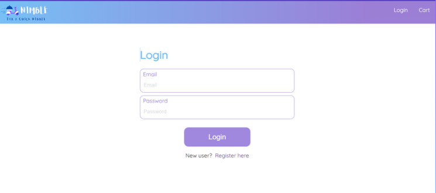

# Nimble - Your Ultimate Food Ordering Destination

Nimble is a full-stack food ordering web application designed to deliver a delightful, customizable meal ordering experience. Whether you crave a hearty meal, a quick snack, or a gourmet treat, Nimble's rich selection and intuitive interface make it easy to discover and order your favorites.

---

## Dashboard Snapshots

Below are placeholders for screenshots of the main pages. Please replace the image placeholders with actual screenshots after adding them to your repo.

### Logo


### Login Page

  

### Register Page

  

### Home Page

  

### Food Item Page

  

### Cart Page

  

### Checkout Page

  

---

## Features

- **User-Friendly Interface:** Browse dishes, view details, and place orders effortlessly with our React-powered frontend.
- **Customizable Orders:** Personalize your meal by selecting ingredients, toppings, and portion sizes.
- **Order History & Favorites:** Track your past orders and quickly reorder your favorite dishes.
- **Cart Management:** Add, remove, and edit items in your cart before checkout.
- **Authentication:** Secure registration, login, and profile management.
- **Tag & Search System:** Filter meals by tags (cuisine, dietary type) or search by name/ingredient.
- **Notifications:** Get instant feedback on actions via toast notifications.

---

## Technology Stack

- **Frontend:** React, React Router, Context API, CSS Modules, Axios, react-toastify
- **Backend:** Node.js, Express, MongoDB (with Mongoose), express-async-handler
- **Other:** Create React App, ESLint, Webpack, Babel

---

## Project Structure

```
nimble-app/
├── client/            # React frontend
│   ├── src/
│   │   ├── components/      # UI components
│   │   ├── pages/           # Route-based pages (Home, Food, Profile, Cart)
│   │   ├── hooks/           # Custom hooks for auth and cart state
│   │   ├── services/        # API service helpers
│   │   ├── App.js           # Main app component
│   │   └── Approutes.js     # Route definitions
│   ├── public/
│   └── README.md
├── server/            # Node.js backend
│   ├── src/
│   │   ├── models/          # Mongoose models
│   │   ├── routers/         # Express route handlers
│   │   └── app.js           # Express app entrypoint
└── README.md          # Project overview
```

---

## Getting Started

### Prerequisites

- Node.js (v16+ recommended)
- npm or yarn

### Installation

#### Backend

```bash
cd server
npm install
npm start
```

#### Frontend

```bash
cd client
npm install
npm start
```

The frontend will run on [http://localhost:3000](http://localhost:3000) and the backend on [http://localhost:5000](http://localhost:5000) by default.

---

## Usage

- Register or log in to start ordering.
- Browse the menu, search for dishes, or filter by tag.
- Add items to your cart, customize as needed.
- Proceed to checkout and confirm your order.
- Access your profile to view order history and manage favorites.

---

## Scripts

From the `client` directory:

- `npm start` — Start development server
- `npm test` — Run unit tests
- `npm run build` — Build for production
- `npm run eject` — Eject configuration (advanced)

From the `server` directory:

- `npm start` — Start backend server
